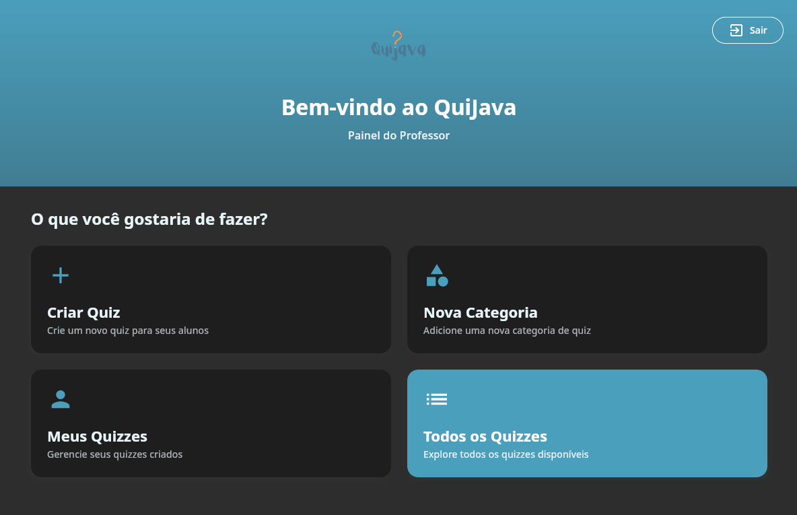
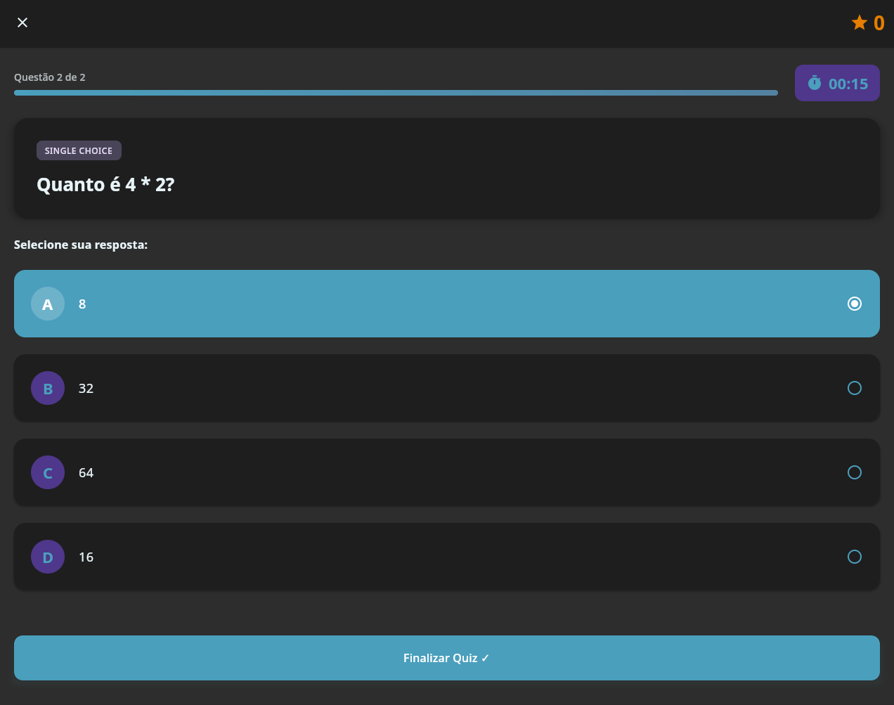
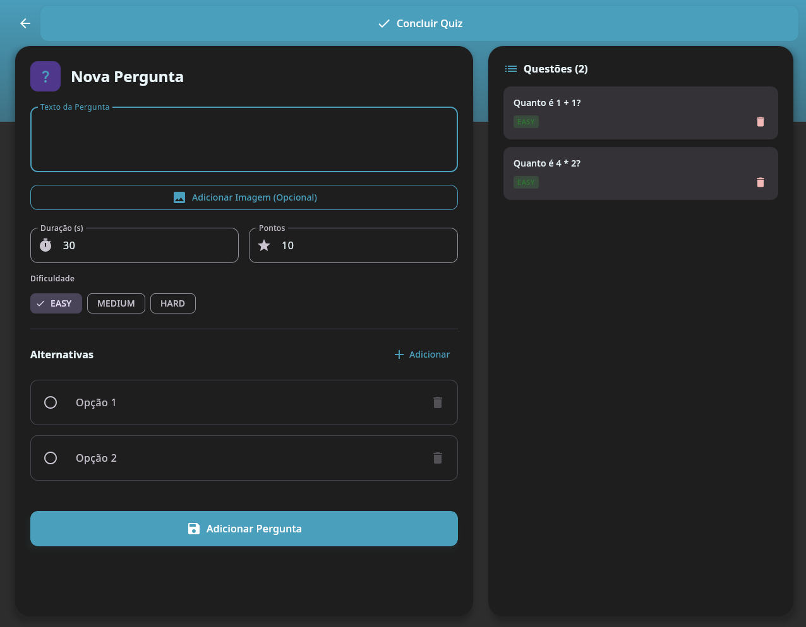
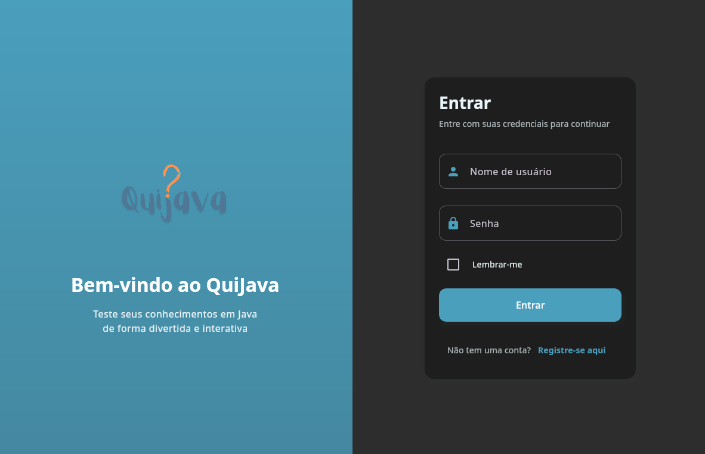

<a name="readme-top"></a>

<div align="center">
  <a href="https://github.com/BrunoF2P/quijava">
    
  </a>

  <h1 align="center">QuiJava</h1>

  <p align="center">
    <b>A plataforma definitiva de quizzes para testar seus conhecimentos!</b>
    <br />
    <i>Desenvolvido com Kotlin, Jetpack Compose Desktop e Spring Boot</i>
    <br />
    <br />
    <a href="#-funcionalidades">Funcionalidades</a>
    ·
    <a href="#-instalação">Instalação</a>
    ·
    <a href="#-telas">Telas</a>
  </p>
</div>

<div align="center">

[](https://kotlinlang.org)
[](https://www.jetbrains.com/lp/compose-multiplatform/)
[](https://spring.io/projects/spring-boot)
[](https://hibernate.org/)

</div>

<br />

## 📖 Sobre o Projeto

**QuiJava** é uma aplicação desktop moderna e interativa para criação e execução de quizzes. Desenvolvido como projeto avaliativo para a disciplina de Linguagem de Programação 2, ele evoluiu para uma plataforma robusta com uma interface de usuário de alto nível.

O projeto combina a robustez do **Spring Boot** no backend com a beleza e fluidez do **Jetpack Compose Desktop** no frontend, oferecendo uma experiência de usuário premium.

---

## 📸 Telas

> *Adicione aqui as capturas de tela do seu projeto para mostrar como ele ficou incrível!*

### 🏠 Menu Principal & Dashboard
<div align="center">
  
  <br>
  <i>Dashboard intuitivo com acesso rápido a todas as funcionalidades</i>
</div>

<br>

### 🎮 Jogando um Quiz
<div align="center">
  
  <br>
  <i>Interface imersiva com timer animado e feedback visual</i>
</div>

<br>

### ✏️ Criação de Quiz
<div align="center">
  
  <br>
  <i>Editor poderoso para criar perguntas personalizadas com imagens</i>
</div>

<br>

### 🔐 Login & Registro
<div align="center">
  
  <br>
  <i>Autenticação segura com opção de "Lembrar-me"</i>
</div>

<br>

### 📜 Histórico de Partidas
<div align="center">
  
  <br>
  <i>Acompanhe seu desempenho e quizzes completados</i>
</div>

---

## ✨ Funcionalidades

### 👤 Para Estudantes
- **Explorar Quizzes:** Navegue por uma vasta biblioteca de quizzes organizados por categorias.
- **Jogar:** Teste seus conhecimentos com um sistema de jogo dinâmico, incluindo timer e pontuação.
- **Ranking:** Veja seu desempenho e compare com outros jogadores.
- **Histórico:** Acompanhe os quizzes que você já completou.

### 👨‍🏫 Para Professores/Admins
- **Criar Quizzes:** Ferramenta completa para criar quizzes com título, descrição, imagem e categorias.
- **Gerenciar Perguntas:** Adicione perguntas de múltipla escolha, defina a dificuldade e o tempo limite.
- **Editor Visual:** Interface moderna para editar quizzes existentes.
- **Gerenciar Categorias:** Crie e organize categorias para manter o conteúdo estruturado.

---

## 🛠️ Tecnologias Utilizadas

- **Linguagem:** Kotlin & Java 21
- **Frontend:** Jetpack Compose Desktop (Material Design 3)
- **Backend:** Spring Boot 3
- **Banco de Dados:** HSQLDB (JPA/Hibernate)
- **Build System:** Gradle

---

## 🚀 Roadmap (Funcionalidades Futuras)

O QuiJava está em constante evolução! Aqui estão algumas das funcionalidades planejadas para as próximas versões:

- [ ] **Perfil de Usuário:** Edição de avatar, senha e visualização de estatísticas detalhadas.
- [ ] **Leaderboard Global:** Ranking com os melhores jogadores de toda a plataforma.
- [ ] **Modo Escuro/Claro:** Alternância de tema manual nas configurações.
- [ ] **Exportar Quizzes:** Compartilhamento de quizzes via arquivo para outros professores.
- [ ] **Sistema de Conquistas:** Badges e medalhas por objetivos alcançados.
- [ ] **Modo Multiplayer:** Desafie um amigo em tempo real!

---

## 🚀 Instalação e Execução

### Pré-requisitos
- JDK 21 instalado
- Git instalado

### Passo a Passo

1. **Clone o repositório**
   ```bash
   git clone https://github.com/BrunoF2P/quijava.git
   cd quijava
   ```

2. **Execute a aplicação**
   ```bash
   ./gradlew run
   ```

> **Nota:** O banco de dados HSQLDB é iniciado automaticamente ou configurado via `application.properties`.

---

## 🤝 Contribuição

Contribuições são o que fazem a comunidade open source um lugar incrível para aprender, inspirar e criar. Qualquer contribuição que você fizer será **muito apreciada**.

1. Faça um Fork do projeto
2. Crie sua Feature Branch (`git checkout -b feature/MinhaFeature`)
3. Commit suas mudanças (`git commit -m 'Adicionando uma nova feature'`)
4. Push para a Branch (`git push origin feature/MinhaFeature`)
5. Abra um Pull Request

---

## 📝 Licença

Distribuído sob a licença MIT. Veja `LICENSE` para mais informações.

---

## 📞 Contato

**Bruno Bispo** - [@brunof2p](https://instagram.com/brunof2p)
<br>
**Gabriel Brandão** - [GitHub](https://github.com/Tartacoding)

Link do Projeto: [https://github.com/BrunoF2P/quijava](https://github.com/BrunoF2P/quijava)

<p align="right">(<a href="#readme-top">voltar ao topo</a>)</p>
