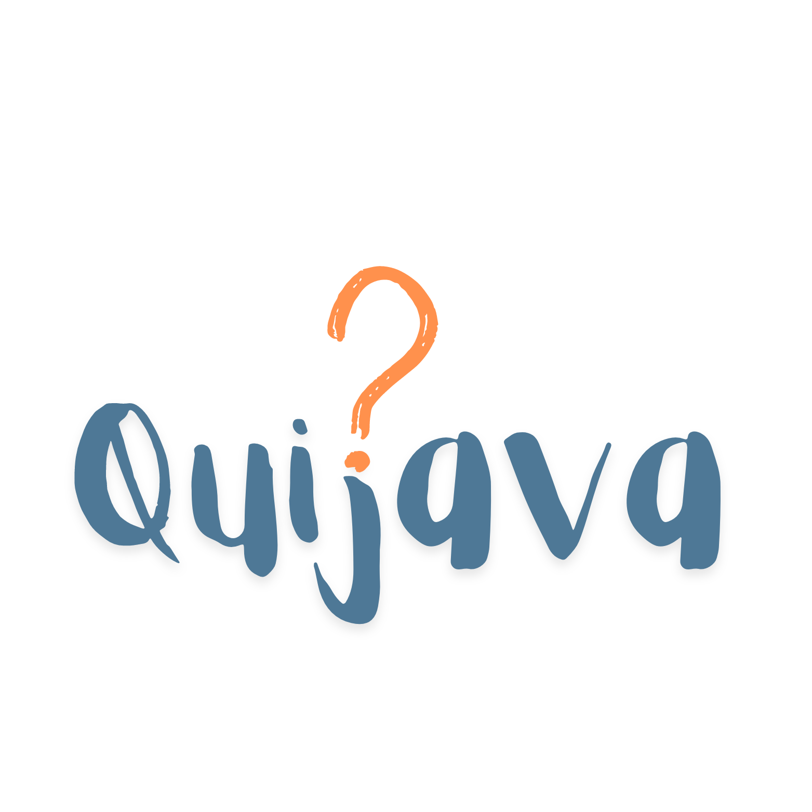

<a name="readme-top"></a>

<!-- LOGO -->
<br />
<div align="center">
  <a href="https://github.com/BrunoF2P/quijava">
    
  </a>

<h3 align="center">Quijava - Quizes para você se divertir</h3>

  <p align="center">
    Projeto avaliativo para LP2 (Linguagem de Programação 2)!
    <br/>
    <a href="https://github.com/BrunoF2P/quijava/issues/new?labels=bug&template=bug-report---.md">Reporte Bug</a>
    ·
    <a href="https://github.com/BrunoF2P/quijava/issues/new?labels=enhancement&template=feature-request---.md">Solicitar recurso</a>
  </p>
</div>


<!-- CONTEUDOS -->
<details>
  <summary>Tabela de Conteudos</summary>
  <ol>
    <li>
      <a href="#sobre-o-projeto">Sobre o Projeto</a>
      <ul>
        <li><a href="#construcao">Construção</a></li>
      </ul>
    </li>
    <li>
      <a href="#comecando">Começando</a>
      <ul>
        <li><a href="#prerequisitos">Pre-requisitos</a></li>
        <li><a href="#instalacao">Instalação</a></li>
      </ul>
    </li>
    <li><a href="#roadmap">Roadmap</a></li>
    <li><a href="#licenca">Licença</a></li>
    <li><a href="#contato">Contato</a></li>
    <li><a href="#agradecimentos">Agradecimentos</a></li>
  </ol>
</details>


<!-- Sobre o Projeto -->
## Sobre o Projeto

O projeto consiste na implementação de um quiz interativo utilizando os princípios e técnicas aprendidos na disciplina de Linguagem de Programação 2. O objetivo é criar uma aplicação que permita aos usuários testarem seus conhecimentos em um determinado tema, apresentando uma série de perguntas e fornecendo feedback instantâneo sobre as respostas escolhidas.


<p align="right">(<a href="#readme-top">inicio</a>)</p>


### Construção


* [![Java][Java]][Java-url]
* [![Javafx][Javafx]][Javafx-url]


<p align="right">(<a href="#readme-top">inicio</a>)</p>

<!-- COMECO -->
## Começando

Antes de começar, verifique se sua máquina atende aos seguintes requisitos:

### Pre-requisitos

1. **Java:** É necessário ter o Java 21 ou uma versão superior instalada na sua máquina. Você pode baixar o Java mais recente em [Java](https://java.com).

2. **Java Terumin no IntelliJ:** Certifique-se de ter o SDK Java Terumin 21 instalado no IntelliJ IDEA. Este SDK é essencial para o desenvolvimento e execução do projeto. 
3. **Banco de dados:** O projeto requer um Banco de dados para armazenar informações, no momento está configurado com o HSQLDB. Você pode encontrar mais informações e baixar o [HSQLDB](https://hsqldb.org).

### Instalação

1. Clone este repositório em sua máquina local usando o comando abaixo:

    ```bash
    git clone https://github.com/BrunoF2P/quijava.git
    ```
2. Navegue até o diretório recém-clonado e abra sua IDE:

    ```bash
    cd quijava
    ```
3. **Atualize o projeto:** Dependendo da sua IDE, você pode precisar atualizar o projeto para que o Maven baixe os plugins adicionados. Em muitas IDEs, isso é feito clicando com o botão direito do mouse no arquivo pom.xml e selecionando a opção para atualizar o projeto ou atualizar as dependências do Maven.
4.  Abra a pasta `db` do projeto:

    ```bash
    cd db
    ```

4. Ligue o servidor do banco de dados executando o seguinte comando (certifique-se de substituir `[PATH_HSQLDB]` pelo caminho para a biblioteca HSQLDB em sua máquina):

    ```bash
    java -cp [PATH_HSQLDB]/lib/hsqldb.jar org.hsqldb.server.Server --database.0 quijavadb --dbname.0 quijavadb
    ```

   Isso iniciará o servidor do banco de dados HSQLDB com o banco de dados `quijavadb`.


5. Siga as instruções específicas do projeto para configurar o ambiente e iniciar o desenvolvimento.

Se você encontrar algum problema durante a instalação ou configuração, entre em contato com os contribuintes do projeto.
<!-- ROADMAP -->
## Roadmap


### Telas
- [ ] Menu
  * Listagem de quizzes por categoria
  * Filtrar por categorias
  - [ ] Informação auxiliar
    * Mostrar se um usuario já realizou um quiz ou não
    * Exibir potuação obtida pelo usuario quiz
- [x] Cadastro
- [x] Criar quiz
- [ ] Gerenciar quizzes feitos pelo administrador
  * Possibilidade de editar pontuação, pergunta, img, tempo de resposta


### Criacao de quiz
- [x] Definição do Quiz
  * Criar interface para inserção de título, descrição e temas.
  * Implementação de funcionalidades para salvar título, descrição e tema do quiz.
- [ ] Configuração de Perguntas
  * Adicionar campo para selecionar o número de perguntas 
  - [x] Implementar opções para escolha do tipo de pergunta
    * Multipla escolha
    * Escolha unica
  - [ ] Implementar opções para escolha do tipo de pergunta
- [x] Permitir definição da pontuação para cada pergunta
- [x] Adicionar imagem para cada pergunta
- [x] Tempo limite para responder cada pergunta
- [ ] Visibilidade
  * Opção para definir se o quiz é publico ou privado

### Cadastro
- [x] Gerenciamento de Usuarios
  * Formulario de registro para novos usuarios
  * Sistema de autenticação de login de usuarios


Para quaisquer funcionalidades adicionais além do escopo planejado ou para qualquer problema conhecido: [Issues](https://github.com/BrunoF2P/quijava/issues)  

<p align="right">(<a href="#readme-top">inicio</a>)</p>


<!-- LICENSE -->
## Licença

Distribuído sob a licença MIT. Consulte `LICENSE.txt` para obter mais informações.

<p align="right">(<a href="#readme-top">inicio</a>)</p>


<!-- CONTACT -->
## Contato

Bruno Bispo: [@brunof2p](https://instagram.com/brunof2p) -
Projetos: [github.com/BrunoF2P](https://github.com/BrunoF2P)

Gabriel Brandão: [](##) - 
Projetos: [github.com/Tartacoding](https://github.com/Tartacoding)

<p align="right">(<a href="#readme-top">inicio</a>)</p>


<!-- ACKNOWLEDGMENTS -->
## Agradecimentos


* [Escolha uma licença de código aberto](https://choosealicense.com)
* [Img Shields](https://shields.io)
* [Template README](https://github.com/othneildrew/Best-README-Template)

<p align="right">(<a href="#readme-top">inicio</a>)</p>


<!-- MARKDOWN LINKS & IMAGES -->
<!-- https://www.markdownguide.org/basic-syntax/#reference-style-links -->
[contributors-shield]: https://img.shields.io/github/contributors/othneildrew/Best-README-Template.svg?style=for-the-badge
[contributors-url]: https://github.com/othneildrew/Best-README-Template/graphs/contributors
[forks-shield]: https://img.shields.io/github/forks/othneildrew/Best-README-Template.svg?style=for-the-badge
[forks-url]: https://github.com/othneildrew/Best-README-Template/network/members
[stars-shield]: https://img.shields.io/github/stars/othneildrew/Best-README-Template.svg?style=for-the-badge
[stars-url]: https://github.com/othneildrew/Best-README-Template/stargazers
[issues-shield]: https://img.shields.io/github/issues/othneildrew/Best-README-Template.svg?style=for-the-badge
[issues-url]: https://github.com/othneildrew/Best-README-Template/issues
[license-shield]: https://img.shields.io/github/license/othneildrew/Best-README-Template.svg?style=for-the-badge
[license-url]: https://github.com/othneildrew/Best-README-Template/blob/master/LICENSE.txt
[linkedin-shield]: https://img.shields.io/badge/-LinkedIn-black.svg?style=for-the-badge&logo=linkedin&colorB=555
[linkedin-url]: https://linkedin.com/in/othneildrew


[Java]: https://img.shields.io/badge/Java-ED8B00?style=for-the-badge&logo=openjdk&logoColor=white
[Java-url]: https://www.java.com/
[Javafx]: https://img.shields.io/badge/javafx-%23FF0000.svg?style=for-the-badge&logo=javafx&logoColor=white
[Javafx-url]: https://openjfx.io/

