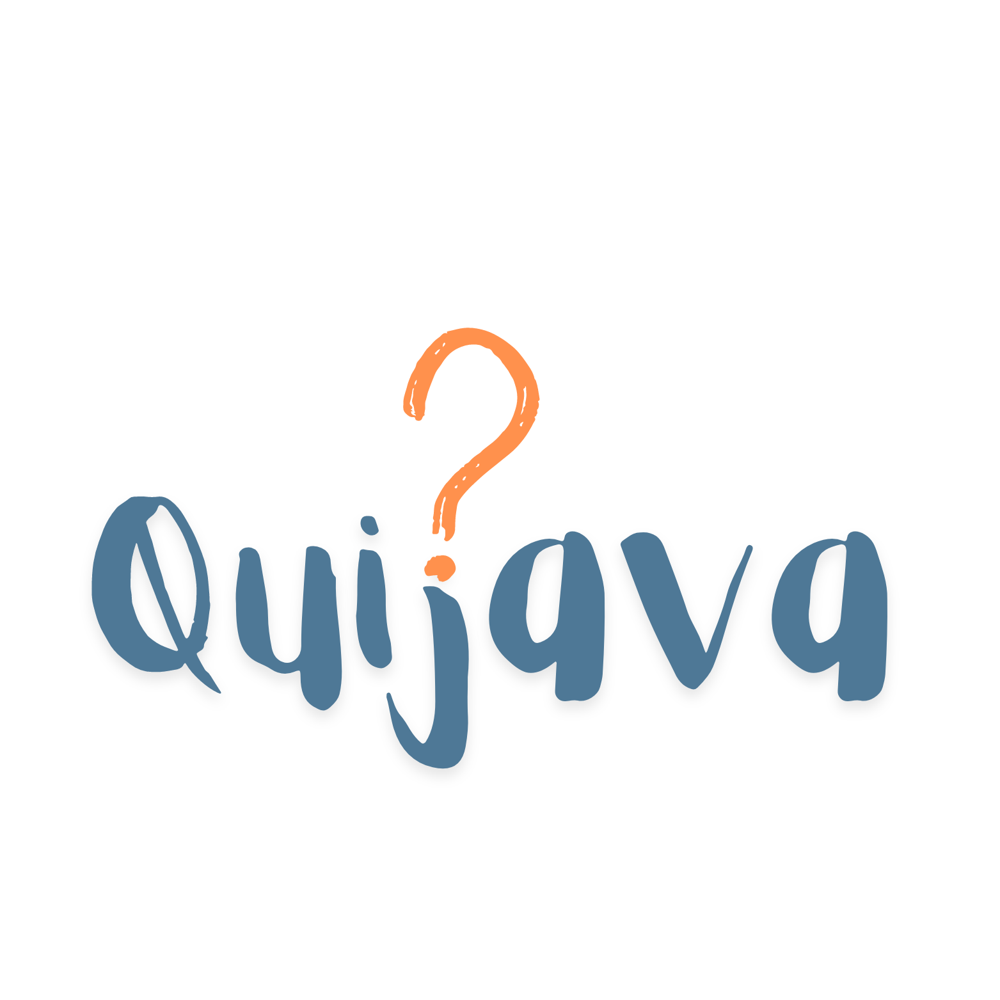

<!-- LOGO -->
 

  

<h3 align="center">Quijava - Quizes para você se divertir</h3>

  

    Projeto avaliativo para LP2 (Linguagem de Programação 2)!
     
    <a href="https://github.com/BrunoF2P/quijava/issues/new?labels=bug&template=bug-report---.md">Reporte Bug</a>
    ·
    <a href="https://github.com/BrunoF2P/quijava/issues/new?labels=enhancement&template=feature-request---.md">Solicitar recurso</a>
  

<!-- CONTEUDOS -->

  
Tabela de Conteudos

  <ol>
    <li>
      <a href="#sobre-o-projeto">Sobre o Projeto</a>
      <ul>
        <li><a href="#construção">Construção</a></li>
      </ul>
    </li>
    <li><a href="#roadmap">Roadmap</a></li>
    <li><a href="#licença">Licença</a></li>
    <li><a href="#contato">Contato</a></li>
    <li><a href="#agradecimentos">Agradecimentos</a></li>
  </ol>

<!-- Sobre o Projeto -->
## Sobre o Projeto

O projeto consiste na implementação de um quiz interativo utilizando os princípios e técnicas aprendidos na disciplina de Linguagem de Programação 2. O objetivo é criar uma aplicação que permita aos usuários testarem seus conhecimentos em um determinado tema, apresentando uma série de perguntas e fornecendo feedback instantâneo sobre as respostas escolhidas.

(<a href="#readme-top">inicio</a>)

### Construção

* [![Java][Java]][Java-url]
* [![Javafx][Javafx]][Javafx-url]

(<a href="#readme-top">inicio</a>)

<!-- ROADMAP -->
## Roadmap

- [ ] Criar tela de cadastro
- [ ] Criar tela de login
- [ ] Criar quiz
- [ ] Criar menu
    - [ ] Listar Quizes
    - [ ] Buscar por categorias

  
Abre o [Issues](https://github.com/BrunoF2P/quijava/issues) para obter uma lista completa dos recursos propostos (e problemas conhecidos).

(<a href="#readme-top">inicio</a>)

<!-- LICENSE -->
## Licença

Distribuído sob a licença MIT. Consulte `LICENSE.txt` para obter mais informações.

(<a href="#readme-top">inicio</a>)

<!-- CONTACT -->
## Contato

Bruno Bispo: [@brunof2p](https://instagram.com/brunof2p) -
Projetos: [github.com/BrunoF2P](https://github.com/BrunoF2P)

Gabriel Brandão:  - 
Projetos: [github.com/Tartacoding](https://github.com/Tartacoding)

(<a href="#readme-top">inicio</a>)

<!-- ACKNOWLEDGMENTS -->
## Agradecimentos

* [Escolha uma licença de código aberto](https://choosealicense.com)
* [Img Shields](https://shields.io)
* [Template README](https://github.com/othneildrew/Best-README-Template)

(<a href="#readme-top">inicio</a>)

<!-- MARKDOWN LINKS & IMAGES -->
<!-- https://www.markdownguide.org/basic-syntax/#reference-style-links -->
[contributors-shield]: https://img.shields.io/github/contributors/othneildrew/Best-README-Template.svg?style=for-the-badge
[contributors-url]: https://github.com/othneildrew/Best-README-Template/graphs/contributors
[forks-shield]: https://img.shields.io/github/forks/othneildrew/Best-README-Template.svg?style=for-the-badge
[forks-url]: https://github.com/othneildrew/Best-README-Template/network/members
[stars-shield]: https://img.shields.io/github/stars/othneildrew/Best-README-Template.svg?style=for-the-badge
[stars-url]: https://github.com/othneildrew/Best-README-Template/stargazers
[issues-shield]: https://img.shields.io/github/issues/othneildrew/Best-README-Template.svg?style=for-the-badge
[issues-url]: https://github.com/othneildrew/Best-README-Template/issues
[license-shield]: https://img.shields.io/github/license/othneildrew/Best-README-Template.svg?style=for-the-badge
[license-url]: https://github.com/othneildrew/Best-README-Template/blob/master/LICENSE.txt
[linkedin-shield]: https://img.shields.io/badge/-LinkedIn-black.svg?style=for-the-badge&logo=linkedin&colorB=555
[linkedin-url]: https://linkedin.com/in/othneildrew

[Java]: https://img.shields.io/badge/Java-ED8B00?style=for-the-badge&logo=openjdk&logoColor=white
[Java-url]: https://www.java.com/
[Javafx]: https://img.shields.io/badge/javafx-%23FF0000.svg?style=for-the-badge&logo=javafx&logoColor=white
[Javafx-url]: https://openjfx.io/

